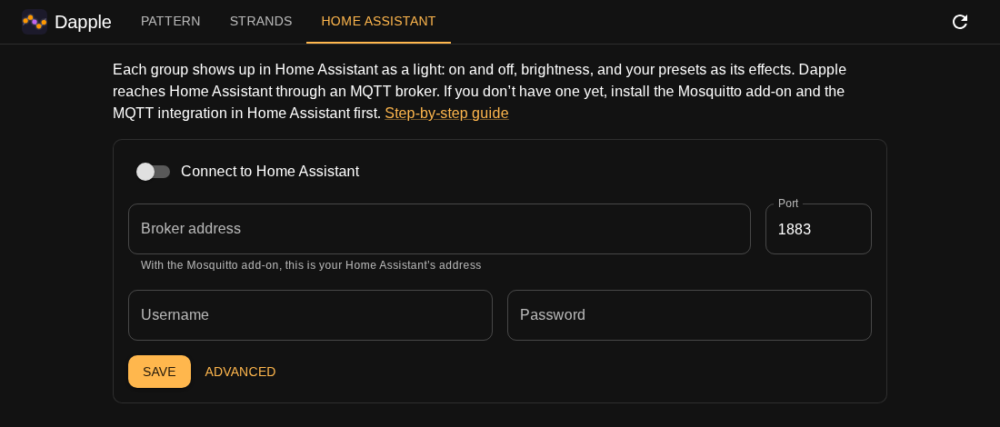

# Dapple with Home Assistant

Each Dapple group shows up in Home Assistant as a **light**. You can switch it on and off, set
its brightness, and pick any of your presets as its **effect**. Home Assistant always shows what
the strands are really doing, even when something other than Dapple changed them.

There's nothing to add to Home Assistant's `configuration.yaml`. Dapple talks to Home Assistant
over MQTT and sets up the lights itself. It's off until you set it up.

---

## Setting it up

**Running Dapple as a Home Assistant app** (see the README's
[On Home Assistant OS](README.md#on-home-assistant-os))**, with the Mosquitto broker installed?**
Dapple has already filled in the broker's address and a login of its own. Open its Home
Assistant tab, turn on **Connect to Home Assistant** and press **Save**. That's all. If you
install Mosquitto after Dapple, or reinstall it, restart the Dapple app so it picks up the
login.

Otherwise:

1. **Give Home Assistant an MQTT broker, if it doesn't have one.** Install the **Mosquitto
   broker** add-on and start it. Home Assistant then offers to set up the **MQTT** integration:
   accept. If you already use MQTT (for Zigbee2MQTT, say), skip this step.
2. **Make a login for Dapple.** The Mosquitto add-on accepts any Home Assistant user. Create one
   just for Dapple under Settings → People → Users.
3. **Fill in Dapple's Home Assistant tab.**

   

   - The broker address is your Home Assistant's address, e.g. `192.168.1.20`.
   - The port is `1883`.
   - The username and password are the ones from step 2.

   Turn on **Connect to Home Assistant** (it starts off) and press **Save**. The tab should say
   **Connected** within a few seconds. If it says something else, see
   [If it doesn't connect](#if-it-doesnt-connect).

The password is saved in `config.yaml` in Dapple's `data` folder, so keep that folder private.
Dapple's page never shows it again: the field stays blank, and leaving it blank keeps the saved
one.

Your groups now appear under Settings → Devices & services → MQTT, one device per group. The
light is named after the group: "Christmas tree" becomes `light.christmas_tree`. Put each one
in an area as you would any other device.

**Renaming a group in Dapple renames the light**, and nothing breaks: automations and dashboards
follow Home Assistant's internal id, which never changes. Deleting a group removes its light.
Saving or deleting a preset updates every light's effect list straight away.

---

## Using the lights

They're ordinary lights, so everything Home Assistant does with lights works: dashboards,
scenes, automations and voice.

Set a preset from an automation or script:

```yaml
action: light.turn_on
target:
  entity_id: light.christmas_tree
data:
  effect: Halloween
```

Add `brightness_pct: 40` to set the brightness too. Turning a light off leaves its pattern on
the strands, and turning it back on brings the same pattern back.

**Everything off at once:** target an area, or make a light group (Settings → Devices &
services → Helpers → Group → Light group) with all your Dapple lights in it:

```yaml
action: light.turn_off
target:
  area_id: garden
```

**Voice:** Assist understands "turn off the Christmas tree" and "set the Christmas tree to 40%"
with no setup. To choose a preset by voice, add a sentence trigger:

```yaml
triggers:
  - trigger: conversation
    command: "set the tree to {preset}"
actions:
  - action: light.turn_on
    target:
      entity_id: light.christmas_tree
    data:
      effect: "{{ trigger.slots.preset }}"
```

---

## Alongside the Twinkly integration

Home Assistant's built-in **Twinkly** integration is fine to keep. The two do different jobs:

- **Twinkly** gives you one light per *strand*, with Twinkly's own colors and effects.
- **Dapple** gives you one light per *group* (which might be several strands wired together),
  with your presets as its effects.

They cooperate:
- Switching a strand off and on with the Twinkly integration brings Dapple's pattern back.
- Brightness is the same setting on both.
- If you pick a Twinkly color or effect, that replaces Dapple's pattern until you choose a
  preset again. The Dapple light then shows **no effect**.

Dapple reads the strands about once a minute, so changes made with the Twinkly integration or
the Twinkly phone app appear on the Dapple light within a minute.

A Dapple light shows as **unavailable** when none of its strands answer, or when Dapple itself
is stopped.

---

## Dapple's own page in Home Assistant

Running Dapple as a Home Assistant app? It's in the sidebar already; skip this.

To open Dapple's editor from the Home Assistant sidebar, go to Settings → Dashboards → Add
dashboard → **Webpage**, and enter Dapple's address, e.g. `http://192.168.1.10:8080/`.

If you reach Home Assistant over `https://`, the browser will refuse to show a plain `http://`
page inside it. Either put Dapple behind the same HTTPS proxy, or open Dapple in its own tab.

The address can point at a particular screen:

| Address | Opens on |
|---|---|
| `…:8080/` | the pattern editor |
| `…:8080/#pattern/tree` | the pattern editor for the `tree` group |
| `…:8080/#strands` | the strand and group list |

---

## If it doesn't connect

The Home Assistant tab shows the reason. The usual ones:

- **Connection refused, or timed out:** the address or port is wrong, or Mosquitto isn't
  running.
- **Not authorized, or bad username or password:** check the login from step 2.
- **Connected, but no lights appear:** the MQTT integration isn't set up in Home Assistant, or
  its discovery prefix was changed from `homeassistant`. Set the same prefix under
  **Advanced** on Dapple's tab.
- **Running two copies of Dapple** (a test copy, say) against one broker: give each its own
  **topic prefix** under Advanced (e.g. `dapple-test`). Otherwise they take over each other's
  lights.

---

## Without MQTT

If you'd rather not run a broker, Home Assistant's `rest_command` can call Dapple directly. You
lose the automatic lights and the state updates, and have to write the YAML yourself. Put this
in `configuration.yaml`, replacing `dapple.lan:8080` with Dapple's address:

- Running Dapple with Docker, that's the machine's address and port, e.g. `192.168.1.10:8080`.
- Running it as a Home Assistant app, Home Assistant reaches it by its hostname, which the app's
  Info page lists: `b68bc6ef-dapple:8080` if you added it with the README's link. Nothing needs
  turning on in the app's Network tab for this.

```yaml
rest_command:
  dapple_preset:
    url: "http://dapple.lan:8080/api/groups/{{ group }}/preset"
    method: POST
    content_type: "application/json"
    payload: '{"name": "{{ name }}"}'
  dapple_brightness:
    url: "http://dapple.lan:8080/api/groups/{{ group }}/brightness"
    method: POST
    content_type: "application/json"
    payload: '{"value": {{ value }}}'
  dapple_on:
    url: "http://dapple.lan:8080/api/groups/{{ group }}/on"
    method: POST
  dapple_off:
    url: "http://dapple.lan:8080/api/groups/{{ group }}/off"
    method: POST
```

```yaml
action: rest_command.dapple_preset
data:
  group: tree
  name: Halloween
```

`group` is the group's id: "Christmas tree" gets `christmas-tree`. The group's **Rename**
dialog on the Strands tab shows it, and so does `http://dapple.lan:8080/api/groups`. It never
changes, even when you rename the group.

Dapple answers even when a strand is unplugged. The reply says which strands took the change:

```yaml
- action: rest_command.dapple_preset
  data:
    group: tree
    name: Halloween
  response_variable: result
- condition: template
  value_template: "{{ not result.content.ok }}"
- action: persistent_notification.create
  data:
    message: >-
      Twinkly trouble:
      {{ result.content.results | rejectattr('ok') | map(attribute='name') | join(', ') }}
```

The full list of endpoints is in [DEVELOPING.md](DEVELOPING.md).
