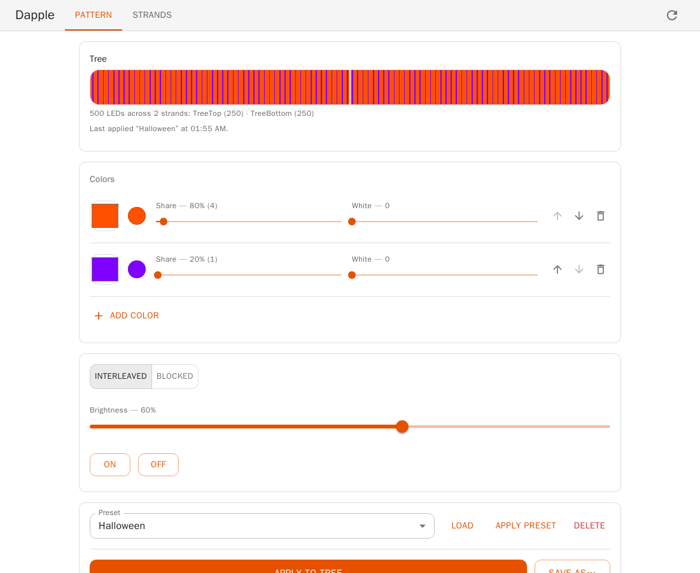
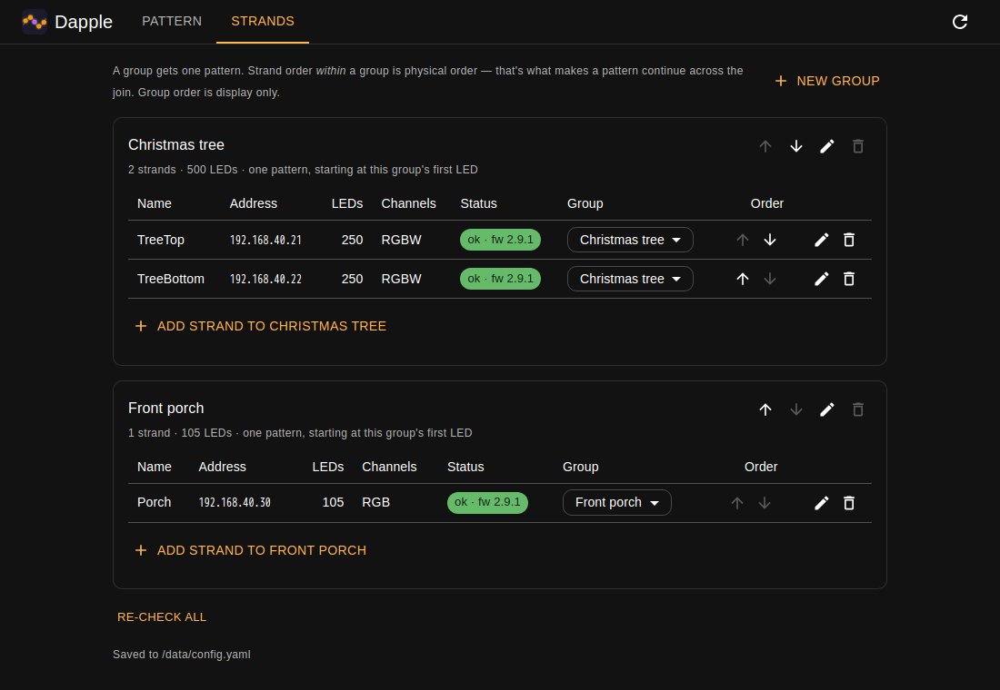

#  Dapple

Dapple lets you set the colors on your Twinkly light strands from a web page on your own
network — "80% orange, 20% purple, mixed evenly" — and save those looks so you can bring them
back with one click.

It runs on your own machine. No Twinkly account, no cloud, nothing leaves your house.



Once you apply a pattern, the lights remember it themselves. You can close the page, turn the
computer off, even unplug the lights and plug them back in — the colors come back.

## Features

- **Multi-color patterns the Twinkly app can't make.** Pick up to eight colors and how much of
  the strand each one gets, then mix them evenly or lay them out in blocks.
- **One pattern across several strands.** Strands wired end to end become one group, and the
  pattern carries on across the join instead of starting over.
- **Groups with their own patterns.** Put the tree in one group and the porch in another, and
  set each one on its own.
- **A preview that matches the lights.** See the pattern on screen before you send it, with
  colors corrected so what you see is what the strands show.
- **Easy color picking.** Choose colors on a rainbow slider. Strands with a separate white
  bulb get a white slider and a plain warm white. The rest get a slider that lightens toward
  white.
- **Saved presets.** Save a look once and put it on any group with one click. Halloween,
  Christmas, July 4th and Warm white are there from the start.
- **On, off and brightness for each group**, with a switch that shows whether the lights are
  really on. It keeps up when you change them from Home Assistant or the Twinkly app.
- **Home Assistant, with no YAML.** Each group shows up as a light, with your presets as its
  effects, so dashboards, scenes, automations and voice commands all work. Home Assistant's
  own Twinkly integration can stay installed alongside Dapple. See
  [HOME_ASSISTANT.md](HOME_ASSISTANT.md).
- **Works on a phone** as well as a computer.
- **Private and simple to run.** It's one Docker container on your own network, with no
  account and no cloud. Everything it remembers is in one folder of plain text files.
- **A REST API** for scripts and other tools. See [DEVELOPING.md](DEVELOPING.md).

---

## Before you start

You'll need three things:

1. **Your Twinkly lights on your Wi-Fi**, set up through the Twinkly phone app as usual.
2. **Each strand at a fixed address.** Your router calls this a "DHCP reservation" or "static
   IP". Without it, your lights may get a new address one day and Dapple will lose track of
   them. If your strands are grouped together in the Twinkly app, ungroup them — Dapple talks
   to each strand directly.
3. **Docker** on the computer that will run Dapple — a NAS, a Raspberry Pi, a spare laptop,
   whatever stays on. If you don't have it, install
   [Docker Desktop](https://docs.docker.com/get-started/get-docker/).

You'll also need each strand's address. The Twinkly app shows it under the device's settings,
or your router's device list will have it. It looks like `192.168.1.50`.

---

## Setting it up

Open a terminal, then copy and paste these lines one at a time:

```bash
mkdir -p dapple/data
cd dapple
curl -fsSLO https://raw.githubusercontent.com/andrewfraley/dapple/main/docker-compose.yml
docker compose up -d
```

The first two make a `dapple` folder with a `data` folder inside it, where Dapple keeps your
settings. The third downloads the one file Dapple needs to run,
[`docker-compose.yml`](docker-compose.yml). If `curl` doesn't work for you, open that link,
download the file and save it into the `dapple` folder instead.

The last line downloads Dapple itself, which takes a minute the first time. When it finishes, open
**<http://localhost:8080>** in your browser.

Running it on a different machine from the one you're browsing on? Use that machine's address
instead of `localhost` — for example `http://192.168.1.10:8080`.

> **If the page doesn't load**, something else on that computer may already be using port 8080.
> Open `docker-compose.yml` in a text editor, change `8080:8080` to `8081:8080`, run
> `docker compose up -d` again, and use `:8081` in the address instead.

---

## Adding your lights

Click the **Strands** tab, then **Add strand**, and type the address of one strand. That's all
you need to enter — Dapple asks the strand how many lights it has and what colors it can make.



It tells you straight away whether the strand answered:

- **ok** — it's talking to Dapple. You'll see its light count and color type filled in.
- **no answer** — Dapple couldn't reach it. Check the address, and that the strand is plugged
  in and on the same network.

Repeat for each strand you have.

---

## Groups: which lights change together

**A group is a set of lights that share one look.** Your tree is a group. Your porch is another.
Change the tree to orange and purple, and the porch stays exactly as it was.

Every strand is in a group. When you add a strand it gets a group to itself, which is right if
it's a standalone run of lights. You only need to do more if **two strands are joined end to end
as one long run** — like a tall tree wrapped with one strand and then a second.

In that case, put both in the same group:

1. On the **Strands** tab, find the second strand and use the **Group** dropdown in its row to
   pick the first strand's group.
2. Use the **↑ ↓** arrows to put them in the order the lights physically run — whichever strand
   starts at the bottom (or wherever your pattern should begin) goes first.

Getting that order right is what makes a pattern flow smoothly from one strand into the next
instead of starting over halfway up. If the pattern looks like it restarts partway along a run,
the order is the first thing to check.

You can rename a group any time with the pencil button. To delete a group, first move its
strands somewhere else — Dapple won't delete a group that still has lights in it, so you can't
lose a strand's address by accident.

---

## Making a pattern

On the **Pattern** tab, pick the group you want at the top (if you only have one, there's
nothing to pick).

- **Color** — slide along the rainbow to choose a color. Every color here is at full strength;
  to make it paler, use the slider below it, and to make it dimmer, use **Brightness**.
- **White** or **Lighten** — makes the color softer and paler. Strands with a separate white
  bulb get **White**, which mixes that bulb in; tick **White only** for a plain warm white.
  Strands without one get **Lighten**, which goes all the way to white at the far end.
- **Share** — how much of the strand that color takes. Shares are relative, so 80 and 20 gives
  you the same result as 8 and 2. Set a share to 0 to park a color without deleting it.
- **Add color** — up to eight.
- **Interleaved or Blocked** — interleaved mixes the colors evenly along the strand. Blocked
  puts them in runs: all the orange, then all the purple, repeating. With Blocked you can set
  how many lights each run gets.
- **Brightness** — takes effect as soon as you let go of the slider.

The preview at the top shows what you're about to get, one dot per light, updating as you change
things. If a group has more than one strand, each gets its own block with its name above it; the
pattern still runs on from one block into the next, just as it will on the lights.

When it looks right, click **Apply**. Nothing reaches the lights until you do.

---

## Saving looks you like

**Save as…** stores the current pattern under a name of your choosing. Saved patterns work on
any group, so you can save "Halloween" once and apply it to the tree one night and the porch the
next.

Dapple starts with four: **Halloween**, **Christmas**, **July 4th** and **Warm white**.

To bring one back, pick it from the **Preset** dropdown and click **Load**. That puts it in the
editor, so you can adjust it first. Nothing reaches the lights until you click **Apply**.

**Delete** removes a saved preset. It doesn't change what your lights are currently showing.

---

## Turning the lights on and off

The switch next to the group's name on the Pattern tab turns that group on and off, and nothing
else. Off doesn't erase the pattern: the lights keep it and show it again when you switch them
back on.

The switch shows what the lights are really doing. If you turn them off from Home Assistant or
the Twinkly app, the page catches up within a few seconds.

---

## If something goes wrong

**A strand says "no answer".**
Check the address is right, the strand is plugged in, and it's on the same network as the
computer running Dapple. If you can reach the strand from the Twinkly app but not from Dapple,
the two devices are probably on different networks — a "guest" Wi-Fi network is a common cause.

**The colors look wrong — orange comes out yellow, or everything looks washed out.**
Dapple corrects for the difference between screen colors and LED colors, but the right amount
varies. Open `data/config.yaml` in a text editor and add a line `gamma: 2.8` at the end for
deeper, richer colors (or `gamma: 1.0` to turn the correction off entirely), then run
`docker compose restart`. If there's a `gamma:` line already, change that one instead.

**A pattern applies with no errors but the lights stay dark.**
A few strands refuse a pattern sent the normal way. Add a line `movie_frames: 2` at the end of
`data/config.yaml` and run `docker compose restart`.

**The pattern restarts partway along a run of lights.**
The two strands are either in different groups, or in the wrong order within their group. See
*Groups* above.

**Only part of a run lights up.**
The strand is under-reporting how many lights it has. The Strands tab shows the number it
reported — if that's wrong, it can be corrected by hand in `data/config.yaml`. If patterns then
stop reaching the strand at all, it won't accept that number: take the correction back out.

**"The config file can't be written."**
Dapple can't save to its `data` folder. On Linux, run `id -u` and `id -g`, open
`docker-compose.yml` in a text editor, put those two numbers in place of the `1000`s after
`PUID=` and `PGID=`, then run `docker compose up -d`.

**Something else.**
`docker compose logs` prints what Dapple has been doing. Warnings mentioning `401` are normal —
the lights hand out short-lived passes and Dapple renews them automatically.

---

## Your settings

Everything Dapple remembers lives in the `data` folder next to `docker-compose.yml`:

| File | What's in it |
|---|---|
| `config.yaml` | your strands, their addresses, which group each is in, and your Home Assistant connection (including its password, so keep the folder private) |
| `presets.json` | your saved patterns |
| `state.json` | what each group is currently showing |

Back up that folder and you've backed up everything. It's all plain text, so you can read and
edit it if you want to.

To update Dapple later, run `docker compose up -d` again. It fetches the newest version first. Your `data` folder is
left alone.

To stop it: `docker compose down`. To start it again: `docker compose up -d`.

---

## Going further

- **[HOME_ASSISTANT.md](HOME_ASSISTANT.md)** — each group shows up in Home Assistant as a
  light, with your presets as its effects. Switch it on in the **Home Assistant** tab; there are
  no Home Assistant files to edit.
- **[DEVELOPING.md](DEVELOPING.md)** — the REST API, how the pattern maths works, and how to run
  Dapple from source.

## What Dapple doesn't do

Animations, music-reactive effects, or different patterns on different parts of one strand. The
pattern is deliberately still — that's what lets the lights hold it on their own with Dapple
switched off.

## License

MIT — see [LICENSE](LICENSE).
